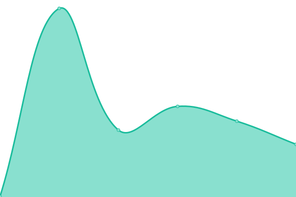

# [📈 Live Status](https://status.yuanhau.com): <!--live status--> **🟧 Partial outage**

This repository contains the open-source uptime monitor and status page for [吳元皓](https://hwtw.cc), powered by [Upptime](https://github.com/upptime/upptime).

With [Upptime](https://upptime.js.org), you can get your own unlimited and free uptime monitor and status page, powered entirely by a GitHub repository. We use [Issues](https://github.com/hpware/upptime/issues) as incident reports, [Actions](https://github.com/hpware/upptime/actions) as uptime monitors, and [Pages](https://status.yuanhau.com) for the status page.

<!--start: status pages-->
<!-- This summary is generated by Upptime (https://github.com/upptime/upptime) -->
<!-- Do not edit this manually, your changes will be overwritten -->
<!-- prettier-ignore -->
| URL | Status | History | Response Time | Uptime |
| --- | ------ | ------- | ------------- | ------ |
|  [主頁](https://yuanhau.com) | 🟥 Down | [.yml](https://github.com/hpware/upptime/commits/HEAD/history/.yml) | 

 142ms
     
 | 

<a href="https://status.yuanhau.com/history/">100.00%</a>
    

|  [Git 系統](https://git.yuanhau.com) | 🟩 Up | [git.yml](https://github.com/hpware/upptime/commits/HEAD/history/git.yml) | 

 1512ms
     
 | 

<a href="https://status.yuanhau.com/history/git">100.00%</a>
    

|  [Wordpress](https://wp.yuanhau.com) | 🟩 Up | [wordpress.yml](https://github.com/hpware/upptime/commits/HEAD/history/wordpress.yml) | 

 1657ms
     
 | 

<a href="https://status.yuanhau.com/history/wordpress">100.00%</a>
    

|  [網址縮短器](https://yhw.tw) | 🟥 Down | [.yml](https://github.com/hpware/upptime/commits/HEAD/history/.yml) | 

 142ms
     
 | 

<a href="https://status.yuanhau.com/history/">100.00%</a>
    

|  [公開版網址縮短器](https://pl.yhw.tw) | 🟥 Down | [.yml](https://github.com/hpware/upptime/commits/HEAD/history/.yml) | 

 142ms
     
 | 

<a href="https://status.yuanhau.com/history/">100.00%</a>
    

|  [MD 讀取器](https://md.yhw.tw) | 🟩 Up | [md.yml](https://github.com/hpware/upptime/commits/HEAD/history/md.yml) | 

 155ms
     
 | 

<a href="https://status.yuanhau.com/history/md">100.00%</a>
    

<!--end: status pages-->

[**Visit our status website →**](https://status.yuanhau.com)

## 📄 License

- Powered by: [Upptime](https://github.com/upptime/upptime)
- Code: [MIT](./LICENSE) © [Anand Chowdhary](https://anandchowdhary.com), supported by [Pabio](https://pabio.com)
- Data in the `./history` directory: [Open Database License](https://opendatacommons.org/licenses/odbl/1-0/)
